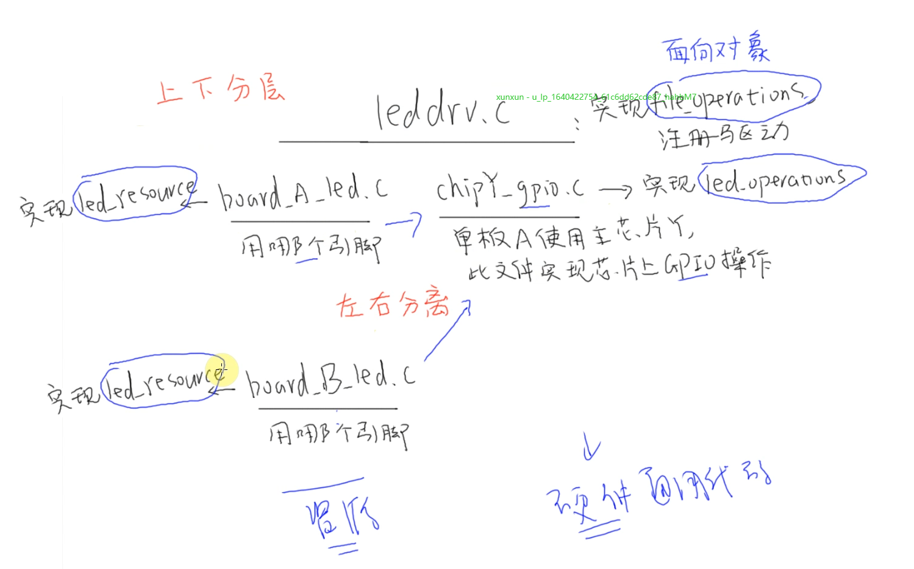

### 驱动单板与芯片 分离思想
  
* 比如gpio的操作他是与芯片强相关的，不同的开发板有不同的外设资源，可他们可能用了相同的芯片  
* 所以gpio的操作对于同一款芯片来说是一样的，可以分离出来，上图的*shipY_gpio.c*

* 但是不同开发板的led驱动，他们的led外设电路可能不同，即用哪个gpio控制led，各不一样
* 所以可以定义不同的外设资源,上图的 *board_B_led.c* 与 *board_A_led.c*
  
  
  
 
 

我这里针对老师给出的源码，稍作了改动，老师是把led_operation写进了chip_demo_gpio  
  
我的思路如下：  
* gpio操作放在chip_gpio_opr.c，向外提供接口  （芯片相关）
* board_A_led.c指定了led对应的gpio引脚号 （单板相关）
* 省略了一层 led_operation (偷懒了)
* 省略了次设备号与led_resource内pin号的对应
* 在led_drv中使用 chip_gpio_opr 与 board_A_led， 实现了简单的分离

