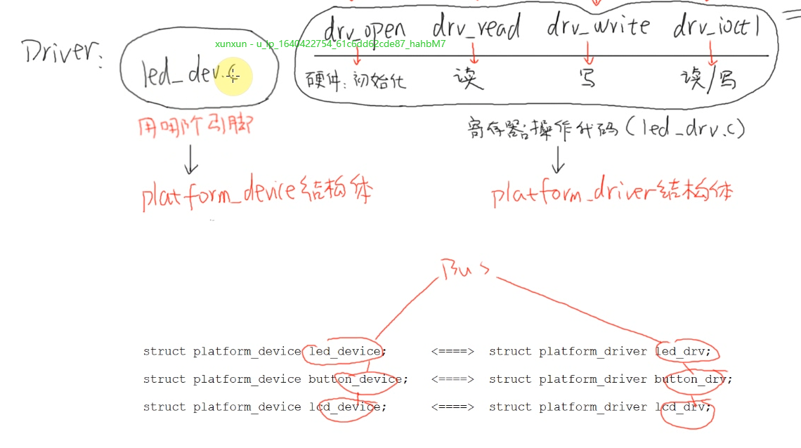
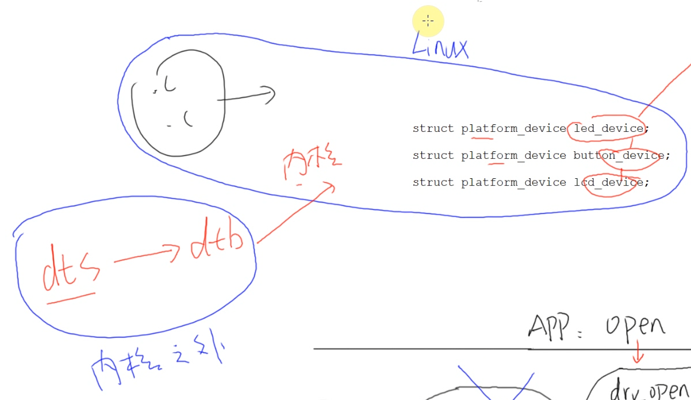
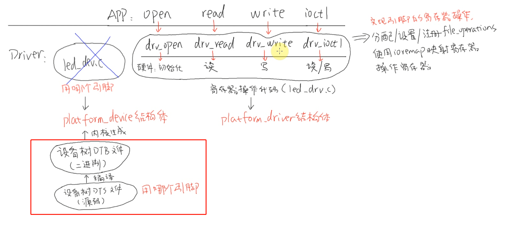
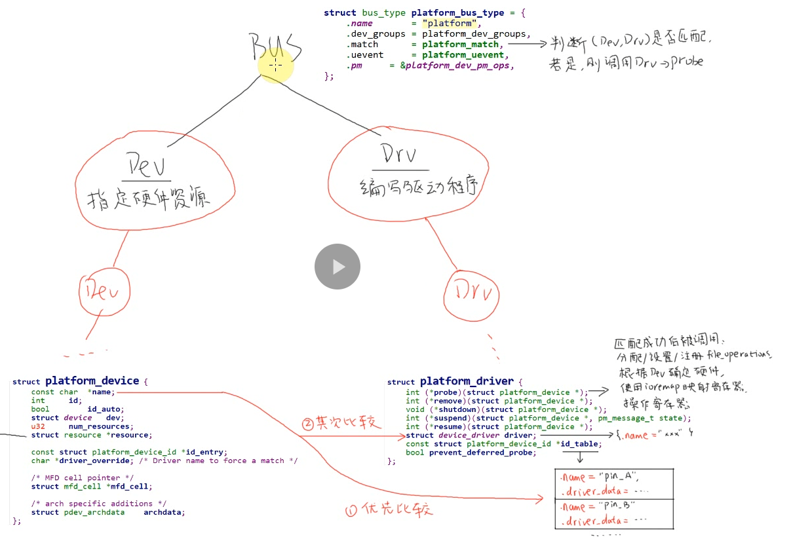

### 总线模型 驱动程序设计思想
  
在04_led_drv_seperate中学习了硬件资源与硬件操作分离的思想

问题点：  
* 每次都要抽象某个驱动的资源，和操作，这太繁琐了
* 某些硬件资源可以使用同一个驱动程序
* 有没有办法让他们自己去匹配，对应

解决方式：  
* linux帮我们抽象出了统一结构体 platform_device 与 platform_driver
* 我们只需要用这2个结构体去声明，实现我们自己的资源与驱动
* linux会使用总线bus来对我们注册的资源与驱动进行管理（匹配、加载）

缺点：  
* 芯片种类繁多，对于同一芯片设计的开发板，资源各不相同
* 因为使用.c文件定义platform_device，内核中会出现大量设备以及重复代码，而且每次都要重新编译内核驱动

***所以只需要把platform_device定义到内核以外就可以了***
 
- - -
### 设备树的引入(不是这一章的重点，可忽略)
  
设备树可以把硬件资源定义到内核以外，我们只需要配置dts文件，编译成dtb  
内核接收到dtb之后进行解析，自动构造出platform_device  

  
- - -

### 资源与驱动匹配
  
匹配由虚拟总线bus来做，当有新的device或driver注册进来时，则会触发匹配，若成功，会调用驱动的probe函数  
匹配逻辑写在了platform_match这个函数指针里  
比较分为3个优先级（若匹配则终止比较）：
1. 比较device.driver_override 是否等于driver.driver.name(这根线上图没有画出)
   1. 若device.driver_override未定义，则进入下一个优先级匹配
   2. 若device.driver_override定义，但未找到与之相等的driver，则终止整个匹配
2. 检查device.name 是否在driver.id_table内
3. 检查device.name 是否等于 driver.driver.name
- - -

### 代码结构
原先我们直接使用xxx_drv.c来创建设备节点，比如有多少个引脚，就创建多少个次设备 led0 led1  
但现在驱动与资源分离，驱动不知道有多少个引脚了，所以得等device与driver配对后，driver才知道有多少资源  
然后driver再调用我们原先写好的xxx_dev.c来创建设备节点  

xxx_pdevice.c  # 注册platform_device 资源 （外设相关）  
xxx_pdriver.c  # 注册platform_driver 驱动，调用 xxx_drv.c创建设备（芯片相关）   
xxx_drv.c  # 被xxx_driver.c调用，注册设备节点 open write接口，类似业务层  
