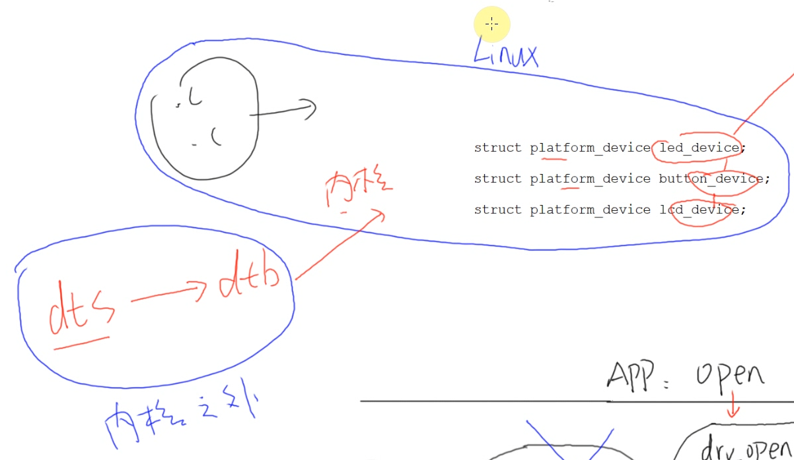
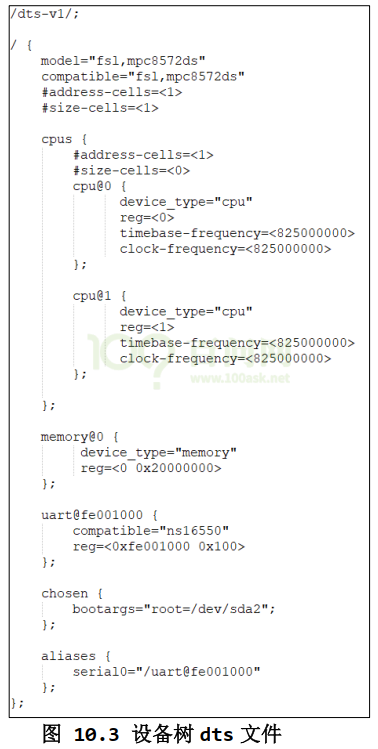
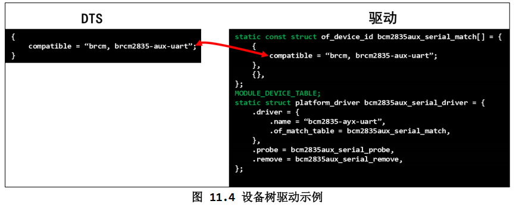

### 设备树
#### 意义
  
按照05_led_drv_bus中的分离思想，会造成大量platform_device.c文件，每次改动都需要重新编译  
设备树dts文件，可以把platform_device.c的内容定义到内核以外      
**我们只需要配置dts文件，编译成dtb，内核接收到dtb之后进行解析，自动构造出platform_device**    
* dtsi文件用于被dts文件#include  
* dts编译成dtb  
* dtb也可以被反编译成dts，使用内核中提供的工具  
 

#### dts文件
  
**一般在内核这个目录下 arch/arm/boot/dts**  
157开发板使用的设备树文件名为: stm32mp157c-100ask-512d-lcd-v1.dts    
具体属性和说明太多了，去看《嵌入式Linux应用开发完全手册》 第十章  
 

#### 字段格式

 

#### 设备树内节点与驱动匹配
  

#### 编译设备树
修改arch/arm/boot/dts/stm32mp157c-100ask-512d-lcd-v1.dts    
回到源码根目录 make dtbs  
把编译出的dtb文件覆盖到板子的 /boot 目录下  
reboot  
查看板子 /sys/firmware/devicetree/base/  下是否生成了节点  
查看板子 /sys/devices/platform/ 下是否生成节点  
insmod led_drv.ko  
insmod led_chip_pdriver.ko  
查看板子 /sys/devices/platform/xunxun_led@0 下driver是否指向正确位置  
 

#### 驱动对应设备树参考例子
kernel/Documentation/devicetree/bindings  

