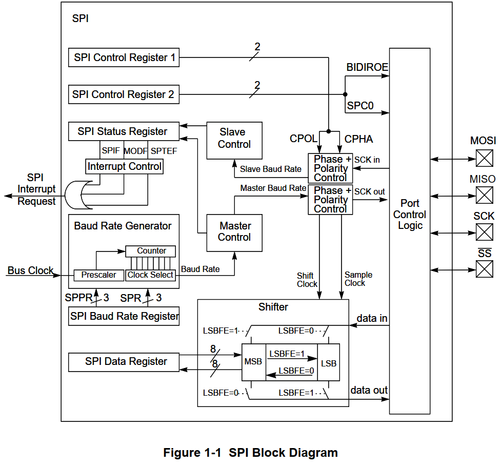
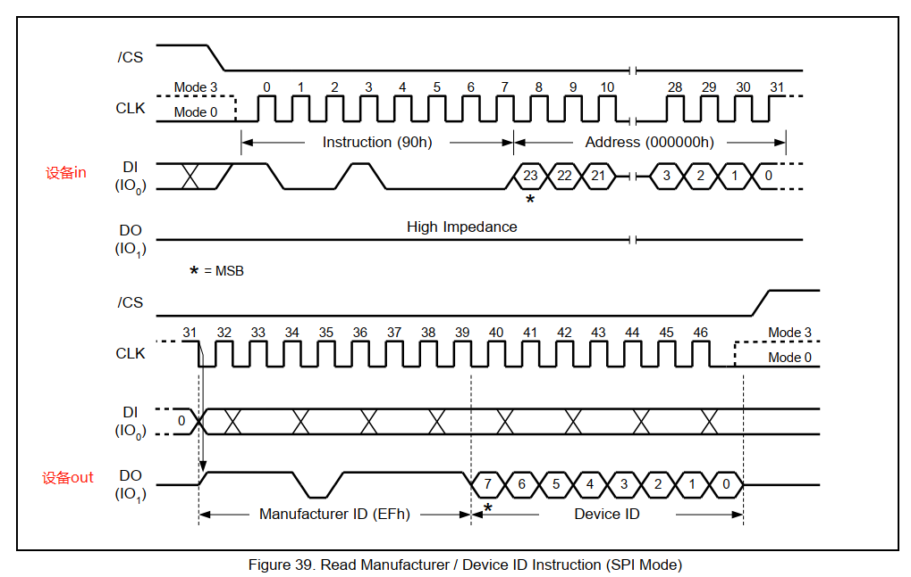

### SPI

    spi驱动分为2部分，控制器驱动、设备驱动  
    spi控制器可以有两种模式，主模式、从模式  
<br>

### SPI协议
- - - 

| 引脚       | 含义                                                        |
|----------|-----------------------------------------------------------|
| DO(MOSI) | Master Output, Slave Input，<br />SPI主控用来发出数据，SPI从设备用来接收数据 |
| DI(MISO) | Master Input, Slave Output，<br />SPI主控用来发出数据，SPI从设备用来接收数据 |
| SCK      | Serial Clock，时钟                                           |
| CS       | Chip Select，芯片选择引脚                                        |

所以spi具有全双工传输能力  

<br>
<br>


#### 4种传输模式  
在SPI协议中，有两个值来确定SPI的模式。
CPOL:表示SPICLK的初始电平，0为电平，1为高电平
CPHA:表示相位，即第一个还是第二个时钟沿采样数据，0为第一个时钟沿，1为第二个时钟沿


| CPOL | CPHA | 模式  |             含义             |
|:----:|:----:|:---:|:--------------------------:|
|  0   |  0   |  0  | SPICLK初始电平为低电平，在第一个时钟沿采样数据 |
|  0   |  1   |  1  | SPICLK初始电平为低电平，在第二个时钟沿采样数据 |
|  1   |  0   |  2  | SPICLK初始电平为高电平，在第一个时钟沿采样数据 |
|  1   |  1   |  3  | SPICLK初始电平为高电平，在第二个时钟沿采样数据 |

CPOL 极性（初始时钟状态） 0表示低 1表示高  
CPHA 相位（第1或2个边沿触发数据采集） 0表示第1个跳变沿 1表示第2个  
根据这2个状态，会组合出4种模式，下面放一张图  
组合起来顺序是 CPOL CPHA 00 01 10 11

<br>
<br>

##### 数据发送过程

比如需要发送2个字节数据，即16位，u8 data[2]  
发送函数是从data[0]开始发送， 从每个字节最高位开始发送  
这2个字节，总共16位，先发高8位还是低8位，取决与设备协议

<br>
<br>

#### SPI控制器内部结构


### 使用linux自带驱动 spi_dev.c
- - -
使用linux自带驱动，写app的方式来访问spi设备  
#### 编译驱动
开启编译，模块编译，或编译进内核  
内核源码目录下make menuconfig
```shell
-> Device Drivers
  -> SPI support (SPI [=y]) 
    < >   User mode SPI device driver support  
```
如果`User mode SPI device driver support`前面不是`<Y>`或`<M>`，可以输入`M`表示把它编译为模块。
* 如果已经是`<Y>`，则不用再做其他事情。
* 如果你设置为`<M>`，在内核目录下执行`make modules`，把生成的`drivers/spi/spidev.ko`复制到NFS目录备用

<br>
<br>


#### 设备树
以下面为例，设备树中spi设备的标签 &spi5，根据具体单板而定  
设备节点中的属性，是按照使用这个设备资源的驱动而定，这里驱动是linux自带的spidev，所以根据他而定  
```c
//使用扩展板的SPI_A引脚
//编辑arch/arm/boot/dts/stm32mp157c-100ask-512d-lcd-v1.dts
//补充成下面这样

//cs-gpios 里有多个用于片选的gpio引脚，与子节点中reg=<>,的序号对应

&spi5 {
        pinctrl-names = "default", "sleep";
        pinctrl-0 = <&spi5_pins_a>;
        pinctrl-1 = <&spi5_sleep_pins_a>;
        status = "okay";
        cs-gpios = <&gpioh 5 GPIO_ACTIVE_LOW>, <&gpioz 4 GPIO_ACTIVE_LOW>;
        spidev: icm20608@0{
                compatible = "invensense,icm20608";
                interrupts = <0 IRQ_TYPE_EDGE_FALLING>;
                interrupt-parent = <&gpioz>;
                spi-max-frequency = <8000000>;
                reg = <0>; //表示使用cs-gpios内第0个
        };

	W25QXX: W25QXX@1 {
		compatible = "spidev";
		spi-max-frequency = <104000000>; //这里用的公司的一个flash模块w25q128，频率为104MHZ
                reg = <1>;//表示使用cs-gpios内第1个
	};

};
```
若设备树没有问题，替换进板子后，加载spidev.ko时，会在/dev/下产生spi的设备节点


<br>

#### 应用层代码
主要分2部分
* 初始化
* 收发函数
```c
//打开设备节点 /dev/spidev0.1
int fd_spi = open(arg_fd_path, O_RDWR);

//模式（极性、相位）
u8 mode = mode | SPI_MODE_3;
status = ioctl(fd_spi, SPI_IOC_WR_MODE, &mode);

//字长
u8 bits = 8;
status = ioctl(fd_spi, SPI_IOC_WR_BITS_PER_WORD, &bits);

//频率
u32 speed = 80000000 //80MHZ
status = ioctl(fd_spi, SPI_IOC_WR_MAX_SPEED_HZ, &speed);

/**
 * 同时发送同时收
 * 
 * wData 发送的数据
 * wDataSize  发送的数据长度
 * rData 接收的数据 （若只发不收可以填NULL）
 * rDataSize 接收的数据长度（若只发不收可以填0）
 * 
 * 发送与接收的长度可以不一样，处理的数据长度会以他两的长度最大值为准
 */
int spi_send_receive(int fd_spi, u8 *wData, u16 wDataSize, u8 *rData, u16 rDataSize) {

    int msgCount = 1;
    struct spi_ioc_transfer xfer[msgCount];
    memset(xfer, 0, sizeof xfer);
    
    xfer[0].tx_buf = (u64) wData;
    xfer[0].rx_buf = (u64) rData;
    xfer[0].len = wDataSize > rDataSize ? wDataSize : rDataSize;
    xfer[0].delay_usecs = 0;
//    xfer[0].speed_hz = 1000000; //ioctl可以配置，这里可以不指定
//    xfer[0].bits_per_word = 8; //ioctl可以配置，这里可以不指定
    
    //status < 0 表示出错
    //status >= 0 其值表示处理的数据长度
    int status = ioctl(fd_spi, SPI_IOC_MESSAGE(msgCount), xfer);

    return status;
}
```
怎么使用这个收发函数,要根据实际spi设备而定，根据设备的芯片手册中的传输时序而定
<br>
<br>
#### 数据传输
以w25q128fv这款spi flash芯片为例  
若使用spi_send_receive这个函数来进行读写，发送一条指令，获取一个响应  
这个响应数据并不会在rData的第0个字节开始，前几个字节都是无效的，到底从第几个字节开始读取，要根据芯片手册上指令的时序  

`8.2.25 Read Manufacturer / Device ID (90h)`  
  
以READ_ID这条指令为例  
先看上半部分时序，指令数据共发送4个字节 0x90 0x00 0x00 0x00    
再看下半部分时序，设备会输出2个字节数据(EFh, Device ID)，是我们需要接收的  
<br>

**（注意：这里有坑）**  
那按照这个逻辑，我应该这样调用函数  
```
u8 wData[] = {0x90 0x00 0x00 0x00};  
u8 rData[2] = {0};
spi_send_receive(fd_spi, wData, 4, rData, 2);
```  
预期是 rData[0] 和 rData[1] 中将会收到设备的响应数据(EFh, Device ID)  
**实验结果发现 rData内数据永远是0**  

**实际上它返回的数据是这样的**  

| item  | byte0  | byte1  | byte2  | byte3  | byte4  |  byte5  |
|-------|:------:|:------:|:------:|:------:|:------:|:-------:|
| 时序图   |  0x90  |  0x00  |  0x00  |  0x00  |  EFh   |   ID    |
| wData |  0x90  |  0x00  |  0x00  |  0x00  |  ---   |   ---   |  
| rData |  ----  |  ----  |  ----  |  ----  |  EFh   |   ID    |   
（rData前面空开了4个字节）  
调用时的接收缓冲区rData，他并不是从缓冲区第一个字节开始写结果，而是按照在整个时序中开始读取的位号写入    
所以应该这样调用  
```
u8 wData[] = {0x90 0x00 0x00 0x00};  
u8 rData[6] = {0}; //定义多大，取决于整个时序长度
spi_send_receive(fd_spi, wData, 4, rData, 6);

//只有这2个字节有值，前面4个字节是空开的
u8 efh = rData[4];
u8 device_id = rData[5];
```  


